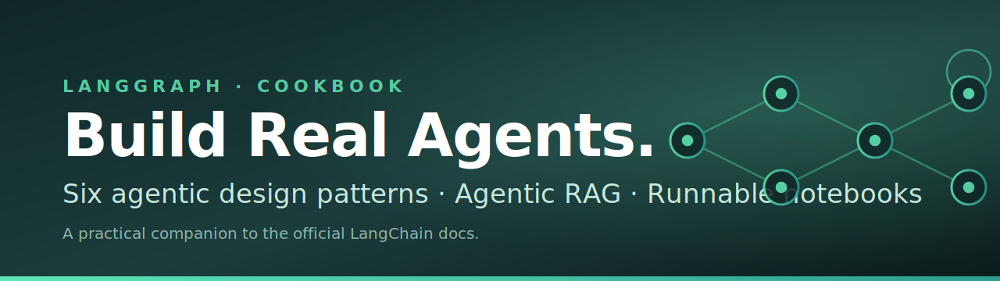

<p align="center">
  
</p>

# LangGraph Cookbook

> **A practical, notebook-first walkthrough of LangGraph — from your first agent to production-style agentic patterns and Agentic RAG.**

Written by [**Muhammad Abdullah**](https://github.com/MuhammadAbdullah95) — Agentic AI Engineer — for anyone learning to build real LLM apps. Every concept has runnable code, plain-language explanations, and the official diagrams from the LangChain docs.

[](https://langchain-ai.github.io/langgraph/)
[](https://python.langchain.com/)
[](https://www.python.org/)
[](https://ai.google.dev/)
[](https://qdrant.tech/)
[](#license)

---

## What you'll learn

By the end of this series you'll be able to:

- Reason about LLM apps as **graphs** (nodes, edges, shared state).
- Build **workflows** (predefined paths) and **agents** (LLM-driven control flow) with LangGraph.
- Apply the **six core agentic design patterns** from the LangChain docs, with real-world examples.
- Build a **production-style Agentic RAG** system using Qdrant + Tavily + Gemini.
- Pick the right pattern for the job — chains, parallelization, routing, orchestrator–worker, evaluator–optimizer, or a full agent.

This isn't theory. Every notebook compiles a real `StateGraph`, renders the diagram, and runs.

---

## Course map

| # | Notebook / Folder | What it teaches |
|---|---|---|
| 1 | [`1st_class.ipynb`](1st_class.ipynb) | First taste of LangGraph — `@tool` decorators, `bind_tools`, a minimal agent |
| 2 | [`Agentic_Design_Patterns/`](Agentic_Design_Patterns/) | The **six core patterns** — one notebook each, with two examples per pattern |
| 3 | [`agentic_rag.ipynb`](agentic_rag.ipynb) | Modern **Agentic RAG** with Qdrant + Tavily fallback (agent-loop, not classical grade-and-rewrite) |

The flagship folder is **[`Agentic_Design_Patterns/`](Agentic_Design_Patterns/)** — that's where you should send people on social media. It has its own [README](Agentic_Design_Patterns/README.md) that stands alone.

---

## Quickstart

This project uses [`uv`](https://github.com/astral-sh/uv) for fast, reproducible installs.

```bash
# 1. Clone
git clone https://github.com/MuhammadAbdullah95/langgraph-cookbook.git
cd langgraph-cookbook

# 2. Install dependencies (creates .venv automatically)
uv sync

# 3. Add your API keys
cat > .env <<'EOF'
GEMINI_API_KEY=your-gemini-key-here
TAVILY_API_KEY=your-tavily-key-here   # only needed for the research agent + RAG fallback
QDRANT_URL=http://localhost:6333      # only needed for agentic_rag.ipynb
QDRANT_API_KEY=                       # leave blank for local Qdrant
EOF

# 4. Open in Jupyter / VS Code and run
uv run jupyter lab
```

> **Don't have `uv`?** `pip install -e .` or `pip install -r requirements.txt` (export from `pyproject.toml`) also works.

### Get the API keys

- **Gemini** (free tier available) → <https://aistudio.google.com/apikey>
- **Tavily** (free 1000 searches/month) → <https://tavily.com/>
- **Qdrant** — run locally with Docker: `docker run -p 6333:6333 qdrant/qdrant`

---

## Repo structure

```
.
├── README.md                          ← you are here
├── pyproject.toml                     uv-managed dependencies
├── 1st_class.ipynb                    Day 1 — LangGraph fundamentals
├── agentic_rag.ipynb                  Modern Agentic RAG (Qdrant + Tavily)
├── Agentic_Design_Patterns/           ⭐ The six patterns
│   ├── README.md
│   ├── 00_workflows_vs_agents.ipynb
│   ├── 01_prompt_chaining.ipynb
│   ├── 02_parallelization.ipynb
│   ├── 03_routing.ipynb
│   ├── 04_orchestrator_worker.ipynb
│   ├── 05_evaluator_optimizer.ipynb
│   └── 06_agent.ipynb
└── images/                            Official diagrams from the LangChain docs
```

---

## The six patterns at a glance

| # | Pattern | Control flow | Use when |
|---|---|---|---|
| 1 | **Prompt Chaining** | Fixed sequence | Ordered steps you can define in advance |
| 2 | **Parallelization** | Fixed fan-out | Independent sub-tasks that can run together |
| 3 | **Routing** | LLM picks one branch | You have multiple specialists |
| 4 | **Orchestrator–Worker** | LLM plans N workers | Sub-tasks aren't known until runtime |
| 5 | **Evaluator–Optimizer** | Generate + grade loop | You can grade outputs and iterate |
| 6 | **Agent** | LLM in full control | Open-ended, tool-driven problems |

> Patterns 1–5 are **workflows** (you wire the graph in advance). Pattern 6 is an **agent** (the LLM decides what to do next). Most real systems combine them.

Read the full series: **[`Agentic_Design_Patterns/`](Agentic_Design_Patterns/README.md)**

---

## Tech stack

| Layer | Choice | Why |
|---|---|---|
| Graph engine | [LangGraph](https://langchain-ai.github.io/langgraph/) | Explicit, debuggable agent control flow |
| LLM framework | [LangChain](https://python.langchain.com/) | Tool decorators, structured output, message types |
| Model | [Gemini 3 Flash](https://ai.google.dev/) | Fast, cheap, generous free tier |
| Vector DB | [Qdrant](https://qdrant.tech/) | Open-source, fast, easy local setup |
| Web search | [Tavily](https://tavily.com/) | LLM-friendly search results |
| Package manager | [uv](https://github.com/astral-sh/uv) | 10–100× faster than pip |

All dependencies are pinned in [`pyproject.toml`](pyproject.toml).

---

## Who this is for

- **Self-learners** — start with `1st_class.ipynb`, then go through `Agentic_Design_Patterns/` in order.
- **Engineers shipping LLM apps** — jump straight to the patterns folder; skim the docs example, study the real-world example, copy what fits.
- **Instructors / mentors** — fork it, run a workshop, the structure is built for teaching.

No prior LangGraph experience needed. Comfortable Python + a basic understanding of LLM APIs is enough.

---

## Acknowledgements

- The pattern definitions, diagrams, and canonical examples come from the official LangChain docs:
  <https://docs.langchain.com/oss/python/langgraph/workflows-agents>
- The "augmented LLM" framing is from Anthropic's [Building Effective Agents](https://www.anthropic.com/research/building-effective-agents) post.
- The Agentic RAG approach is adapted from Qdrant's [agentic RAG with LangGraph](https://qdrant.tech/) tutorial.

---

## Contributing

Found a typo, a broken link, or a pattern that could use a better real-world example? **PRs are welcome.** Open an issue first if you want to discuss a larger change.

---

## License

MIT — use, share, remix, teach with it. Attribution appreciated but not required.

---

## Connect

I write and ship agentic AI systems for a living. Follow along for more LangGraph, LangChain, and agentic-AI deep-dives:

- **GitHub:** [@MuhammadAbdullah95](https://github.com/MuhammadAbdullah95)

If this repo helps you, **star it** so others can find it — and share it with one person who's stuck building agents.
